# Fine-grained Access Control Package
# Technologies
- Laravel
- Tailwind
# Installation
1. In the terminal:
```shell
	composer require laravelroles/rolespermissions
```
    
2. Register service provider in file /bootstrap/providers.php
```shell
return [
    ...
    Laravelroles\Rolespermissions\RolespermissionsServiceProvider::class,
];
```  
3. Register package middleware in bootstrap/app.php
```shell
->withMiddleware(function (Middleware $middleware): void {
        $middleware->alias([
            'bindings' => SubstituteBindings::class,
            'permissions.required' => PermissionsRequiredMiddleware::class
        ]);
    })
```   	    
4. In terminal:
```shell
	php artisan vendor:publish --provider="Laravelroles\Rolespermissions\RolespermissionsServiceProvider"
```
5. In terminal:
```shell
	php artisan migrate
```	
6. In terminal:
```shell
	composer dump-autoload
```
7. In terminal:
```shell
	php artisan laravelroles:seeder
```

8. Class App\Models\User extends Laravelroles\Rolespermissions\Models\User
```shell

	use Laravelroles\Rolespermissions\Models\User as BaseUser;


	class User extends BaseUser

	{


	}
```
9. Set localization in config/app.php - bg or en
    
10. Log in main program with example user test@test.bg and password test

# Middleware

Add attribute to the middleware name

```shell
Route::resource('salaries', 'SalaryController')->middleware('permissions.required:user_id');
```
# Interfaces

- Users

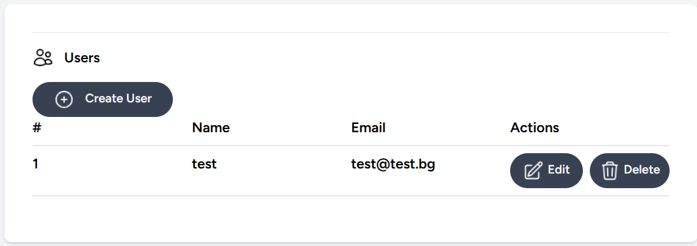
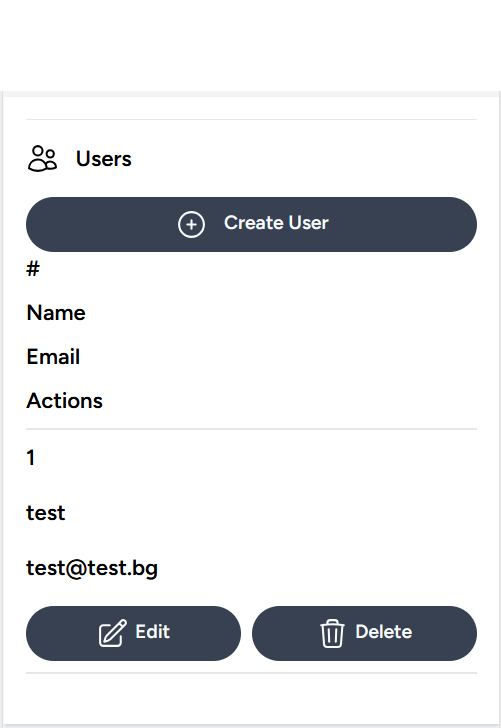
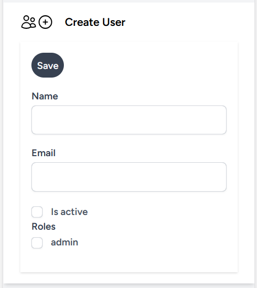
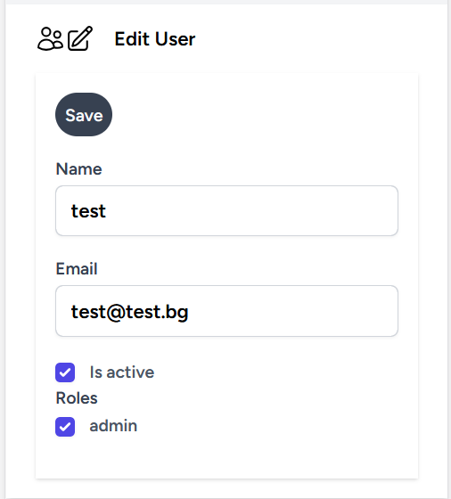
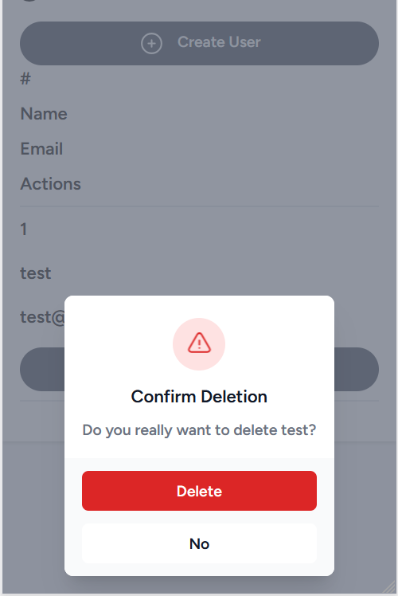

- Roles

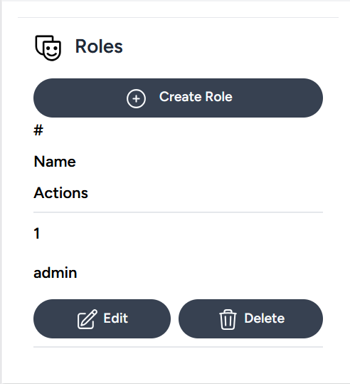
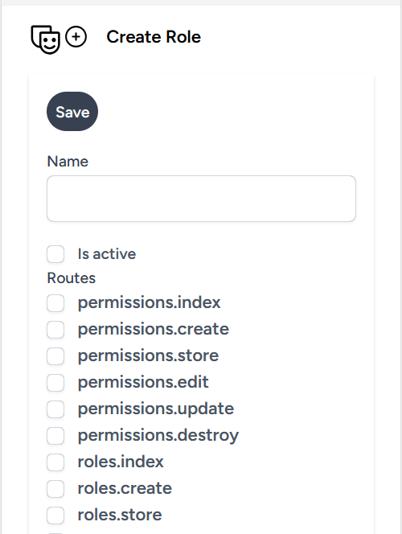
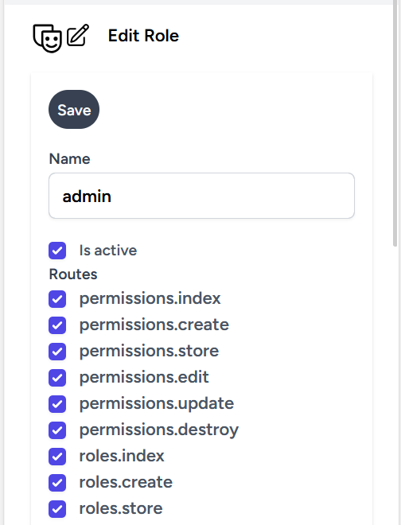
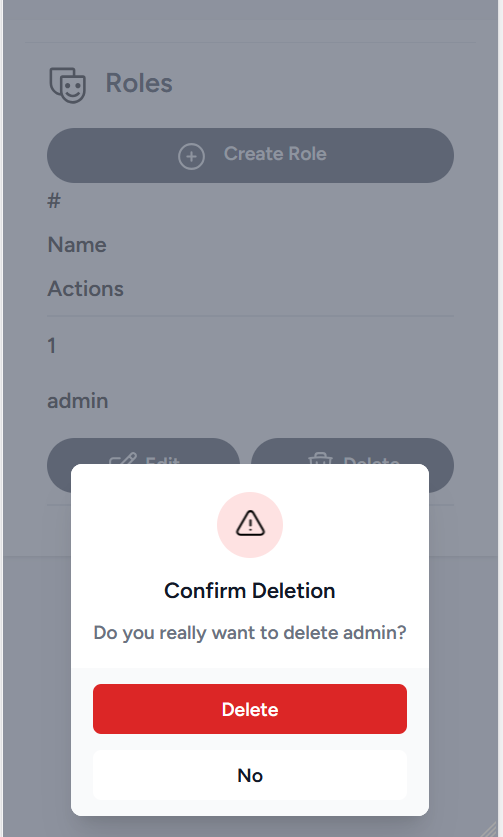

- Permissions

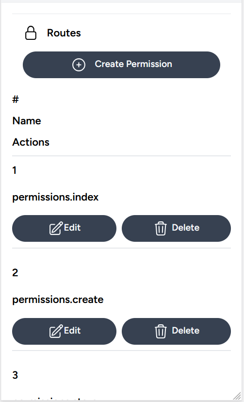
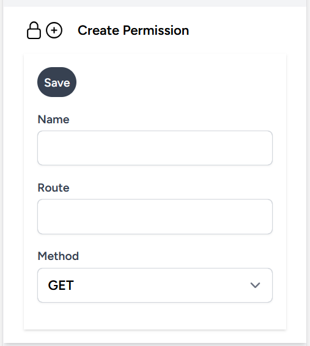
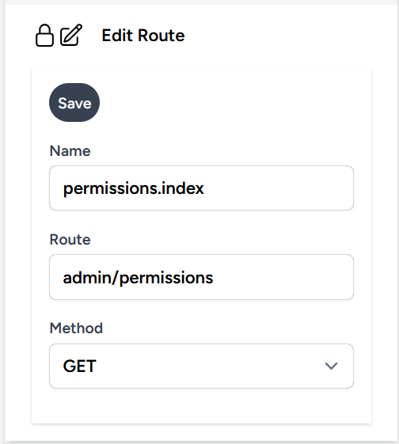
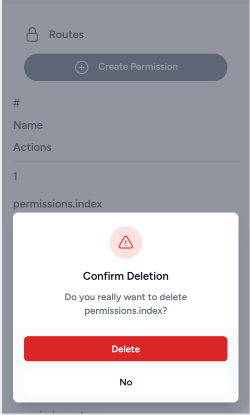


